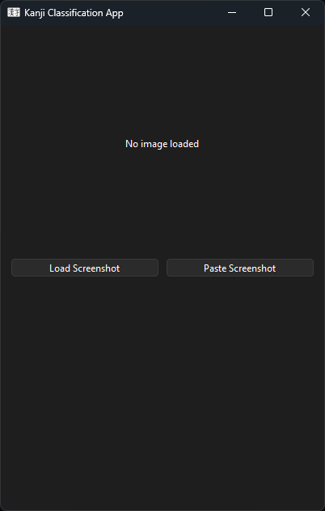
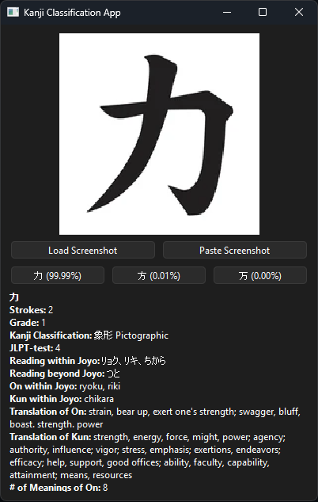

# Kanji Classification CNN

## Dataset
[Generated](dataset/src/data_generation.py) using these free fonts:
| Font | Found / Downloaded | License |
|------|--------------------|---------|
| `AoyagiSosekiFont2` | [Found and downloaded](https://www.freekanjifonts.com/japanesefont-aoyagisoseki-download/) | Commercial use OK |
| `ipamjm` | [Found and downloaded](https://github.com/ken1row/IPSJ-techrep-xelatex) | [License](dataset/data/fonts/licenses/IPAフォントライセンスv1.0.txt) |
| `JiyunoTsubasa` | [Found and downloaded](https://www.freekanjifonts.com/japanesefont-jiyuno-tsubasa/) | You can use it for both personal and commercial use |
| `KikaiChokokuJISTTF` | [Found](https://www.freejapanesefont.com/kikai-chokoku-jis-font-download/) [Downloaded](https://font.kim) | Free for personal and commercial use |
| `KouzanMouhituFontOTF` | [Found and downloaded](https://www.freekanjifonts.com/japanesefont-kozan-mohitsu-download/) | Commercial-use OK |

and a list of the 1000 most used kanji from [https://www.kanjidatabase.com/index.php](https://www.kanjidatabase.com/index.php) (and additional data per kanji) using this query:
```sql
SELECT
  `Kanji`,
  `Strokes`,
  `Grade`,
  `Kanji Classification`,
  `JLPT-test`,
  `Reading within Joyo`,
  `Reading beyond Joyo`,
  `On within Joyo`,
  `Kun within Joyo`,
  `Translation of On`,
  `Translation of Kun`,
  `# of Meanings of On`,
  `# of Meanings of Kun`
FROM KANJI6654
WHERE Grade IS NOT NULL
  AND `JLPT-test` IN ('5','4','3','2')
ORDER BY `Kanji Frequency without Proper Nouns` DESC
LIMIT 1000
```

The dataset is [augmented](dataset/src/data_augmentation.py) dynamically during training (slight rotation, shifts, color inversion, ...).


## Model
The CNN model was built using PyTorch and trained to label images to the 1000 most used japanese kanji characters.

### Architecture
Standard deep convolutional neural network for batch of grayscale 64x64 images (B, 1, 64, 64).
- 4 Convolutional blocks
  - 2 x (Conv2d, BatchNorm2d, ReLU)
  - MaxPool2d
  - Dropou2d
- Global average pooling
- Classifier

Output at start of training:
```bash
Using device: cpu
Loading processed data...
Loaded 5000 samples with 1000 classes
Input shape: (5000, 64, 64, 1)
Preparing data loaders...
Train batches: 7032, Val batches: 8
Creating model...
Total parameters: 1,818,184
Trainable parameters: 1,818,184
```

### Best model
The best model was [trained](model/src/training.py) for `8` epochs (manually stopped) and achieved validation accuracy of `0.966` and loss of `0.3865`.

## Application
You can run the application in `main.py`.
Either 
- load an image from your device or
- paste a screenshot.
You can read the top 3 predictions and the models confidence level and their descriptions.

   
